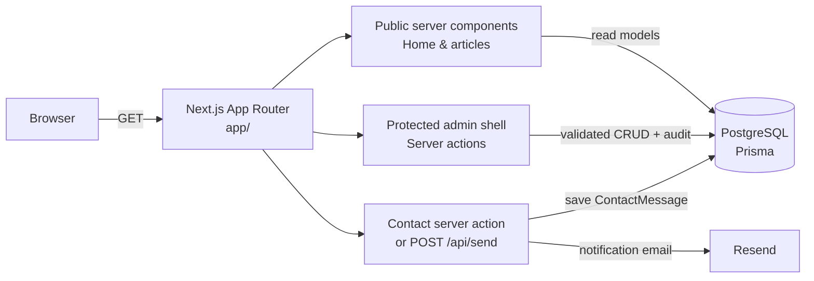
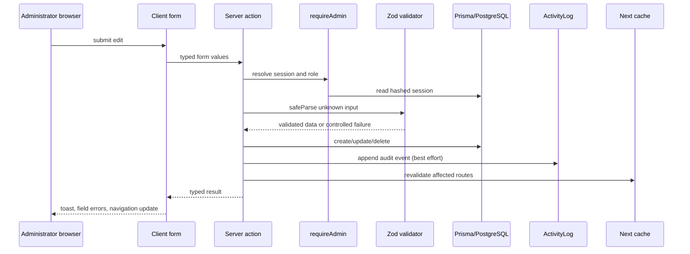
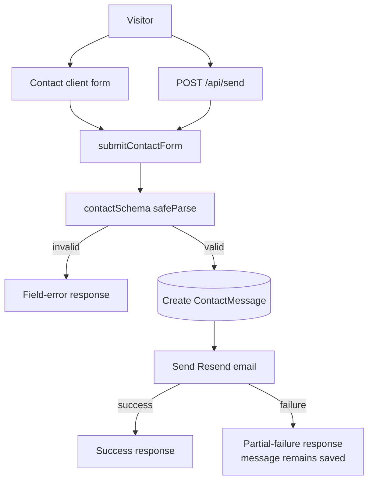

# hoceinir Architecture Guide

> **Purpose.** This document is the maintainers’ guide to the architecture of the `hoce1n/hoceinir` portfolio application. It describes the system as checked out at `main` commit `fbe4c2a` on 2026-08-19. It explains the implemented runtime, its extension points, its operations model, and the known seams that should be handled deliberately rather than assumed away.

## 1. System at a glance

`hoceinir` is a database-backed personal portfolio and lightweight publishing system built as a single Next.js application. The public site renders a terminal-inspired portfolio, project list, published articles, and contact form. A protected `/admin` area manages the public content, contact inbox, administrator sessions, and audit history. PostgreSQL is the system of record, Prisma is the persistence boundary, and Resend is used only for contact-notification delivery. [1] [2] [3]

| Architectural concern | Implemented choice | Maintainer implication |
| --- | --- | --- |
| Application framework | Next.js 16 App Router with React 19 | Routes, layouts, error boundaries, server actions, and route handlers live under `app/`. |
| Language and modules | TypeScript with `strict: true` and `@/*` alias | New code must type-check without emitted JavaScript and should import through `@/`. [4] |
| Rendering model | Dynamic server rendering for the public home, articles, and admin surfaces | Fresh database reads are expected at request time; do not introduce caching without an explicit invalidation design. [5] [6] |
| Database | PostgreSQL through Prisma 7 and the `@prisma/adapter-pg` driver adapter | `lib/db.ts` is the sole shared client entry point. [3] |
| Authentication | Custom opaque, database-backed admin sessions | The cookie carries a raw random token; PostgreSQL stores only its SHA-256 hash. [7] |
| Content management | Protected App Router pages plus server actions | Content is editable by administrators and read by public server components. [8] |
| Validation | Zod on public input and admin mutation boundaries; React Hook Form in interactive forms | Treat schemas in `lib/validators/` and `lib/contact-schema.ts` as the input contract. [9] |
| Email | Resend with a React Email component | A contact message is persisted before notification is attempted; notification failure is a partial failure. [10] |
| UI | Tailwind CSS 4, shadcn/ui/Radix primitives, custom terminal components, Sonner | Preserve the dark terminal language and reuse shared UI primitives rather than recreating controls. [1] |

The application is intentionally a **modular monolith**. There is one deployable Next.js process, one relational database, and one external transactional-email service. No queue, background worker, separate API service, or event bus is currently part of the deployed path.



## 2. Repository topology and dependency direction

The codebase is organized by Next.js runtime boundary first, then by reusable application layer. The dependency direction should remain **routes and components → data/actions/validators → Prisma client**, while the database client must not import UI or route code.

| Path | Responsibility | Rules for maintainers |
| --- | --- | --- |
| `app/` | App Router route tree, layouts, special states, route handlers, and server actions | Keep route-specific mutations alongside the route group when they are not reusable across domains. |
| `app/admin/` | Login route and protected administration area | Every sensitive page and server action must enforce `requireAdmin()`, even though the proxy pre-check exists. [7] [8] |
| `app/articles/` | Public article archive and slug detail route | Fetch only published articles through `lib/data/articles.ts`. [6] |
| `components/` | Presentation and client interaction components | Prefer existing `ui/`, `terminal/`, `layout/`, `sections/`, and `admin/` categories. |
| `lib/data/` | Public/admin read models and record-to-view-model transformations | Keep Prisma details and public filtering here, not in display components. [5] [6] |
| `lib/auth/` | Session lifecycle, password verification, audit writer, constants | This is the authoritative custom-admin auth layer. [7] [11] |
| `lib/validators/` | Zod schemas for admin mutations and identifiers | Mutations receive `unknown`, parse at the boundary, and return controlled failures for invalid input. [9] |
| `prisma/` | Prisma schema, seed script, and migration metadata | Schema changes must be paired with an operational migration strategy. [2] [12] |
| `scripts/` | Operational scripts | The documented administrator bootstrap is `pnpm create-admin`. [13] |
| `docs/` | Maintainer and integration documentation | Update this guide when architectural contracts change. |

The root layout creates the global provider hierarchy: Google-loaded Inter and JetBrains Mono font variables, TanStack Query, the theme provider, Sonner notifications, and Vercel Speed Insights. Most data is still read in server components; TanStack Query is available for client features but is not the primary persistence or cache path today. [14] [15]

## 3. Routing, layouts, and rendering

### 3.1 Public route map

The public route tree is deliberately small. The root page composes section components after concurrently loading site settings, about data, all published articles, the latest LOG articles, projects, uses groups, and social links. It passes the latest three LOG records to the log-card section while preserving all published poetry for the homepage poetry display. [5] [6]

| URL | Route module | Rendering and behavior |
| --- | --- | --- |
| `/` | `app/page.tsx` | Dynamic portfolio homepage composed from database-backed sections. |
| `/articles` | `app/articles/page.tsx` | Dynamic archive of all published LOG and POETRY records, newest published date first. [6] |
| `/articles/[slug]` | `app/articles/[slug]/page.tsx` | Dynamic, published-only article page with per-article metadata and Markdown content. Missing or unpublished slugs resolve through `notFound()`. [16] |
| `/api/send` | `app/api/send/route.ts` | `POST` adapter that forwards JSON input to the same contact server action used by the UI. [17] |
| `/_not-found` and unmatched paths | `app/not-found.tsx` | Terminal-themed 404 recovery state. |
| Route error | `app/error.tsx` | Client error boundary that supports retry and return-home recovery. |
| Root error | `app/global-error.tsx` | Standalone `html`/`body` fallback used when the root layout cannot render. |
| Loading state | `app/loading.tsx` | Global terminal-themed loading feedback. |

The public routes explicitly export `dynamic = "force-dynamic"`. This is compatible with the database-first content model and means changes appear on the next request after the relevant data has been invalidated. If a maintainer chooses to introduce ISR, `unstable_cache`, or static generation, they must revisit every mutation’s revalidation list and document the new cache contract. [5] [6] [16]

### 3.2 Admin route map

`app/admin/layout.tsx` wraps the whole admin route space. The `/admin/login` route is intentionally allowed through the proxy. All content-management pages are nested inside `app/admin/(shell)/`, whose layout calls `requireAdmin()` before rendering the sidebar, top bar, or page child. This gives both a fast redirect on missing cookies and a server-side authority check against the database. [7] [8] [18]

| Area | Paths | Primary records or actions |
| --- | --- | --- |
| Authentication | `/admin/login` | Login and logout server actions; session creation/destruction. |
| Dashboard | `/admin` | Aggregated content counts and process-level health display. [19] |
| Projects | `/admin/projects`, `/new`, `/[id]/edit` | `Project` CRUD. |
| Articles | `/admin/articles`, `/new`, `/[id]/edit` | `Article` CRUD for both LOG and POETRY. |
| About | `/admin/about` | Singleton `AboutSection` update. |
| Uses | `/admin/uses`, `/new`, `/[id]/edit` | `UsesGroup` CRUD. |
| Messages | `/admin/messages`, `/[id]` | Contact inbox lifecycle plus contact settings and social-link management. |
| Activity and sessions | `/admin/logs` | Audit-log viewer and session revocation. |
| Site settings | `/admin/settings` | Singleton `SiteSettings` editor for header, hero, footer, navigation, and contact copy. |

Navigation is configuration-driven through `lib/admin-nav.ts`; the sidebar and command palette should consume that shared configuration rather than embedding duplicate route lists. [20]

## 4. Data architecture

### 4.1 Prisma client and connection policy

`lib/db.ts` creates a Node `pg` pool from `DATABASE_URL`, adapts it with `PrismaPg`, creates a `PrismaClient`, and memoizes the client through `globalThis` outside production. Route code must import `db` from this module rather than create a separate Prisma client. This avoids excess client instances during development reloads and retains a single persistence entry point. [3]

The Prisma generator writes generated artifacts to `lib/generated/prisma`. These files are generated output, not hand-authored domain logic. Do not edit them directly; regenerate them through the Prisma lifecycle.

### 4.2 Canonical domain model

The schema has three broad groups: **identity and audit**, **public portfolio content**, and **contact/inbox**. PostgreSQL is canonical for every group; no public content remains dependent on the older static `lib/content.ts` fixture module. [2] [5]

| Model | Purpose | Key constraints and relationships |
| --- | --- | --- |
| `AdminUser` | Back-office identity | Unique email; `OWNER`, `ADMIN`, or `EDITOR`; owns sessions and may own audit events. |
| `AdminSession` | Opaque login session | Unique hashed token; expiration, last-use timestamp, IP, and user agent; cascade-deleted with its user. |
| `ActivityLog` | Best-effort audit history | Action/entity/entityId/detail/IP; optionally linked to an admin user and retained if that user is deleted. |
| `Project` | Public portfolio project | Status enum (`LIVE`, `WIP`, `ARCHIVED`), array tags, publication switch, sortable order. |
| `Article` | LOG or POETRY publication | Globally unique slug; kind enum; publication switch/date; index on `(kind, published)`. |
| `UsesGroup` | Grouped setup/tooling content | Group name, shell-like command string, string-array items, sortable order. |
| `SocialLink` | Public/social contact channel | Name, handle, URL, sortable order. |
| `AboutSection` | Singleton personal profile | Fixed primary key `about`; string-array paragraphs and JSON stats. |
| `SiteSettings` | Singleton site chrome/content | Fixed primary key `site`; JSON navigation plus hero/header/footer/contact fields. |
| `ContactMessage` | Public contact submission | Status enum (`NEW`, `READ`, `ARCHIVED`) and status index. |

`AboutSection.stats` and `SiteSettings.nav` are stored as JSON. `lib/data/content.ts` validates both shapes on read using Zod before it returns typed view data. This is intentional defensive parsing at a JSON persistence boundary; if either field shape changes, update the schema, read parser, write validator, seed, and admin form together. [2] [5]

### 4.3 Read models and public visibility rules

Public components do not directly use raw Prisma rows. The data modules define presentation shapes and enforce visibility rules.

| Query helper | Visibility and ordering contract |
| --- | --- |
| `getProjects()` | Only `published: true`, ascending `order`; normalizes enum status to lowercase UI values. |
| `getArticles()` | Only published records, then groups POETRY before LOG for homepage use. |
| `getLatestLogArticles(limit = 3)` | Only published LOG entries, ordered by `publishedAt DESC`, then `order ASC`; lower-bounds the requested limit to one. |
| `getAllPublishedArticles()` | All published entries, ordered by `publishedAt DESC`, then `order ASC`. |
| `getArticleBySlug(slug)` | Published-only lookup; returns `null` for absent and unpublished entries. |
| `getUsesGroups()` and `getSocials()` | All records in ascending `order`; these records have no publication flag. |
| `getAbout()` and `getSiteSettings()` | Load fixed singleton keys and throw with a seeding instruction when missing. |

The singleton readers make database initialization a hard dependency. A newly provisioned environment must seed `about` and `site` before the public homepage or the settings forms are expected to function. [5] [12]

## 5. Content and mutation architecture

### 5.1 Admin mutation contract

Server actions are the principal write boundary for management workflows. A standard action follows this sequence:

1. Call `requireAdmin()` before reading or writing protected data.
2. Parse identifiers and `unknown` input with a domain Zod schema.
3. Perform the Prisma mutation.
4. Capture request metadata where audit context is useful.
5. Write an `ActivityLog` event through `logActivity()`.
6. Revalidate the public and administrative paths affected by the change.
7. Return a typed success/failure result that a client form can display.

The message/social action module demonstrates the full pattern, including invalid-ID handling, Prisma `P2025` handling, audit metadata, and precise invalidation helpers. Project, article, uses, about, and settings actions follow the same design. [8] [9] [11]



### 5.2 Revalidation is part of correctness

Because key pages are dynamic, revalidation is primarily a consistency signal and a guard against future cache additions. It is still required at the mutation boundary. The expected scope is domain-specific:

| Mutation domain | Expected invalidation | Why |
| --- | --- | --- |
| Projects | `/`, `/admin`, `/admin/projects`, relevant edit path | Project cards and management list change. |
| Articles | `/`, `/admin`, `/admin/articles`, affected `/articles/[slug]` paths | Homepage snippets, archive, detail pages, and list change. |
| About / uses / social / settings | `/` plus relevant admin paths | These fields drive public sections and site chrome. |
| Contact message lifecycle | `/admin`, `/admin/messages`, message detail when relevant | Public site is not modified; inbox views must refresh. |
| Session revocation | `/admin`, `/admin/logs` | Dashboard/session list and activity view must refresh. |

For article slug updates, revalidate both the new and former slug route so stale detail output cannot survive a rename. [8]

### 5.3 Client form pattern

Interactive public and admin forms use React Hook Form with `zodResolver`, create controlled pending states, map server-side field failures to UI fields where available, and surface operation summaries through Sonner. The public contact form is the clearest example: it validates client-side against the shared `contactSchema`, calls the server action, maps returned field errors, and clears the form only after success. [9] [21]

Never rely on client validation for security. It is user experience only; the server action validation remains mandatory.

## 6. Authentication, authorization, and audit

### 6.1 Session lifecycle

Authentication is not Supabase Auth or NextAuth. It is a custom admin-session implementation.

| Step | Behavior |
| --- | --- |
| Login | The login server action validates credentials, looks up an active user, verifies the stored password hash, records login activity, and redirects to `/admin`. [22] |
| Session creation | A 32-byte random base64url token is generated. Its SHA-256 hash, expiry, IP, and user agent are stored in `AdminSession`; only the raw token is written to the browser cookie. [7] |
| Cookie policy | Cookie name is `admin_session`; it is `httpOnly`, `sameSite=lax`, scoped to `/`, marked `secure` in production, and expires after 14 days. [7] [23] |
| Request authentication | `getSession()` hashes the cookie token, reads the session and user, rejects missing/expired/inactive data, then asynchronously updates `lastUsedAt`. [7] |
| Authorization | `requireAdmin()` redirects unauthenticated callers to `/admin/login`. Every protected page/action must call it. [7] |
| Logout | `destroySession()` deletes matching database sessions and clears the cookie; logout records an audit event when an authenticated user was found. [7] [22] |
| Revocation | Any administrator may revoke their own sessions; `OWNER` may revoke every user’s session. [24] |

The `proxy.ts` matcher is a **cookie-presence pre-filter only**. It redirects a request with no `admin_session` cookie before a protected `/admin` page renders. It does not verify token validity, session expiry, user activity, or role. Server-side `requireAdmin()` is therefore the authoritative access control and must never be removed as “redundant.” [7] [18]

### 6.2 Roles

The persisted role enum is `OWNER | ADMIN | EDITOR`. The current implementation uses it for role visibility in the shell/dashboard and for cross-user session revocation; it is not a complete per-resource permission matrix. In particular, the standard content actions enforce authentication but do not currently distinguish `ADMIN` from `EDITOR` mutation capabilities. Any future granular authorization should centralize policy in a small capability helper and retrofit every action rather than scatter role checks across individual forms. [2] [24]

### 6.3 Audit behavior

Administrative mutations invoke `logActivity()` with user, action, entity, entity ID, optional JSON detail, and IP where available. The helper writes to PostgreSQL but catches and logs its own persistence failures, preventing audit-write failure from rolling back an otherwise successful content change. This is an intentional **best-effort audit** policy, not a transactional audit guarantee. If compliance requires non-repudiation, redesign mutations to use database transactions or an outbox pattern. [8] [11]

## 7. Public contact flow and HTTP integration

The contact path is intentionally available through two adapters that converge on one business action.



`submitContactForm()` treats persistence as the first durable event: it validates input, creates `ContactMessage`, and only then attempts a Resend notification. A database failure returns a full failure. An email failure returns a clear message that the record was saved, allowing the inbox to remain the recovery channel. The API route is intentionally thin and applies the same result shape with a `200` or `400` response; do not duplicate validation or Resend behavior there. [10] [17] [21]

The contact action defaults the sender and recipient to `onboarding@resend.dev` when environment configuration is absent. This is appropriate for bootstrap but should be treated as a production misconfiguration signal, not a safe delivery default. Set and verify `RESEND_FROM_EMAIL` and `CONTACT_TO_EMAIL` in every production environment. [10] [25]

## 8. UI architecture and style system

The visual language is a dark, Linux-terminal-inspired interface. The component architecture separates page composition from interaction and presentation primitives.

| Component group | Role |
| --- | --- |
| `components/layout/` | Shared `SiteHeader` and `SiteFooter` used by public routes. |
| `components/sections/` | Homepage domains: hero, about, articles, projects, uses, contact. |
| `components/articles/` | Markdown presentation for article content. |
| `components/admin/` | Dashboard shell: sidebar, topbar, command palette, and domain forms. |
| `components/terminal/` | Terminal window chrome, prompts, typing, and falling-text visual motifs. |
| `components/ui/` | shadcn/Radix-based primitives such as buttons, forms, dialog, alert dialog, tables, and toast host. |
| `components/fx/` | Isolated presentational motion effects such as magnetic cards. |

The root layout supplies Inter for general text and JetBrains Mono for the terminal identity. Use semantic Tailwind tokens (`bg-background`, `text-foreground`, `text-primary`, `border-border`) rather than hard-coded palette values when extending layouts. The existing special App Router pages are the reference implementation for terminal-style system states. [14] [1]

The public site preserves basic accessibility patterns, including a skip-to-content link on the homepage, semantic sections/headings, disabled loading controls, and client-visible validation text. New components should retain keyboard-friendly controls and avoid turning presentation effects into requirements for interaction. [5] [21]

## 9. Error handling and observability

### 9.1 User-facing recovery

The App Router has four dedicated states:

| State | File | Recovery intent |
| --- | --- | --- |
| Missing route | `app/not-found.tsx` | Explain unavailable content and provide a home path. |
| Route failure | `app/error.tsx` | Display an error boundary with retry and home actions. |
| Root failure | `app/global-error.tsx` | Render its own document structure when the normal root layout is not reliable. |
| Pending navigation | `app/loading.tsx` | Show immediate terminal-style loading feedback. |

Maintain the standalone nature of `global-error.tsx`: it cannot depend on root-layout context or assumptions that may have caused the original fault.

### 9.2 Current observability scope

The administration dashboard reports content counts and lightweight Node-runtime metrics, while `ActivityLog` captures user-triggered back-office events. Vercel Speed Insights is included in the root layout for frontend performance telemetry. There is no configured structured logging provider, tracing system, error reporter, job monitor, or health endpoint in the current architecture. [14] [19]

`console.error` is used for persistence/email failures and failed best-effort audit writes. This is sufficient for basic platform logs but not for production incident management. Before adding external observability, define which data must be redacted—especially contact content, email addresses, session identifiers, and password data.

## 10. Local development, database lifecycle, and deployment

### 10.1 Environment contract

The committed example file supports the following active runtime and operations settings. Never commit live values.

| Variable | Consumer | Required for |
| --- | --- | --- |
| `DATABASE_URL` | `lib/db.ts` | Runtime PostgreSQL access. |
| `RESEND_API_KEY` | `app/actions.ts` | Contact notification delivery. |
| `RESEND_FROM_EMAIL` | `app/actions.ts` | Verified Resend sender identity. |
| `CONTACT_TO_EMAIL` | `app/actions.ts` | Contact-notification recipient. |
| `ADMIN_EMAIL` | `scripts/create-admin.ts` | First/repair OWNER provisioning. |
| `ADMIN_PASSWORD` | `scripts/create-admin.ts` | First/repair OWNER provisioning; requires at least 12 characters. |

There is an important configuration seam: runtime database access uses `DATABASE_URL`, while `prisma.config.ts` configures Prisma CLI’s datasource as `DIRECT_URL`. `DIRECT_URL` is not presently included in `.env.example`. A maintainer should either add and document `DIRECT_URL` for CLI operations or align the Prisma configuration with the runtime URL where that is appropriate for the hosting topology. Do not assume `pnpm prisma migrate deploy` will work with only the documented example variables. [3] [25] [26]

### 10.2 Bootstrap procedure

A new environment needs the application dependencies, database schema, singleton seed records, and an owner account.

```bash
pnpm install
cp .env.example .env
# Configure production-safe values in .env
pnpm prisma generate
pnpm prisma migrate deploy
pnpm prisma db seed
ADMIN_EMAIL=admin@example.com ADMIN_PASSWORD='use-a-long-random-password' pnpm create-admin
pnpm dev
```

The seed command is configured as `tsx prisma/seed.ts`. It upserts the fixed `about` and `site` singleton records and provides starter content. The custom owner script creates an active `OWNER` user or reactivates/upgrades an existing account by email. [12] [13] [26]

> **Migration caution.** The current tracked `prisma/migrations/` directory contains the migration lock but no application migration files. Treat the schema/production-database alignment as a release risk until a baseline migration strategy is recorded and committed. Do not make an unreviewed schema change directly against production.

### 10.3 Build and quality gates

| Command | Purpose |
| --- | --- |
| `pnpm dev` | Start Next.js development mode. |
| `pnpm lint` | Run ESLint across the project. |
| `pnpm typecheck` | Run strict TypeScript checking without emitting files. |
| `pnpm build` | Generate Prisma client, then create a production Next.js build. |
| `pnpm start` | Serve the built application on port `4173`. |
| `pnpm create-admin` | Provision or repair the designated OWNER user from environment variables. |

The minimum pre-merge workflow is `pnpm lint && pnpm typecheck && pnpm build && git diff --check`. A database-related change also requires verifying `prisma generate`, the migration path in an isolated database, seed behavior, and the affected public/admin read paths. [1] [4] [26]

### 10.4 Deployment model

Deploy the project as one Node-compatible Next.js application with reachable PostgreSQL and Resend credentials. The build script already runs `prisma generate`; migrations must be handled in a deliberate release step against the correct connection. Public pages and admin actions use runtime database reads, so deployment success without a reachable and initialized database is not functional success. [1] [3] [26]

## 11. Maintenance playbooks

### 11.1 Add a new managed content domain

Create the Prisma model and indexes first. Add a Zod validator file, a public read model if the record is visible publicly, server actions that authorize/validate/audit/invalidate, route pages under `app/admin/(shell)/`, and domain form components under `components/admin/`. Add navigation centrally. Seed any required singleton or starter records. Finally, add the new domain’s revalidation paths and test both public visibility and administrative CRUD.

| Change step | Required artifact | Common failure prevented |
| --- | --- | --- |
| Persistence | `prisma/schema.prisma` and committed migration strategy | Database/UI shape drift. |
| Input boundary | `lib/validators/<domain>.ts` | Untrusted form values reaching Prisma. |
| Public reads | `lib/data/<domain>.ts` | Leaking drafts or coupling UI to raw records. |
| Admin writes | Route-local `actions.ts` | Missing authorization, auditing, or revalidation. |
| UI route | `(shell)` page plus client form | Unprotected or inconsistent management UX. |
| Navigation | `lib/admin-nav.ts` | Unreachable feature and duplicate navigation config. |
| Initialization | `prisma/seed.ts` when required | Runtime missing-singleton failures. |

### 11.2 Change a singleton shape

For `AboutSection` or `SiteSettings`, treat the change as a cross-layer contract migration. Update the Prisma field, Zod read parser, Zod write schema, seed upsert, data helper output type, admin form default values, and all public consumers. The stable IDs (`about`, `site`) must remain stable unless a coordinated data migration removes the singleton contract. [2] [5] [12]

### 11.3 Change an admin permission

First define the intended capability rule in one shared authorization helper. Then apply it in server actions—not only UI visibility—and test its behavior for `OWNER`, `ADMIN`, and `EDITOR`. UI hiding alone is not authorization. The existing session-revocation action is the reference for role-aware server enforcement. [24]

### 11.4 Retire or rewrite a public route

Preserve the special error and not-found recovery paths, revise public navigation and links, remove or redirect retired slugs deliberately, and update article revalidation lists if route semantics change. For public record removal, the read model’s published-only behavior is the primary privacy boundary; do not expose raw data fetches in a new page just to simplify implementation. [6] [16]

## 12. Known architectural seams and recommended follow-up

This section is deliberately candid. These items are not necessarily bugs, but they are material context for anyone taking ownership of the codebase.

| Priority | Observation | Why it matters | Recommended maintenance decision |
| --- | --- | --- | --- |
| High | `prisma.config.ts` expects `DIRECT_URL`, but runtime and `.env.example` use `DATABASE_URL`. | CLI migration commands can fail or target an unintentionally configured database. | Establish one documented production migration connection policy and align the template/config. [25] [26] |
| High | No application migration files are currently tracked beyond Prisma’s lock metadata. | Schema deployment is not reproducible from repository history alone. | Generate and commit a reviewed baseline migration before further schema evolution. [26] |
| Medium | `lib/server.ts`, `lib/middleware.ts`, `lib/client.ts`, `lib/config.server.ts`, `lib/error-page.ts`, and `lib/error-capture.ts` have no in-repository imports from active route/component paths. | They may confuse future contributors into assuming Supabase or alternate middleware/error systems are active. | Confirm they are obsolete and remove them, or document and integrate them intentionally. |
| Medium | `lib/content.ts` is still present while active public pages use Prisma data modules. | Static fixtures can diverge from production content and architectural intent. | Remove it if unused, or declare a scoped role (for example, seed source). |
| Medium | The README describes a narrower, earlier shape of the project and still says content is primarily in `lib/content.ts`. | Onboarding guidance can lead maintainers to edit the wrong layer. | Update `README.md` to point to this document, admin CRUD, and Prisma-backed content. [1] |
| Medium | Audit logging is best effort, not transactional. | A successful mutation may lack a log row during a database/audit failure path. | Keep this policy consciously, or use transactional/outbox logging for stronger guarantees. [11] |
| Low | Root metadata still uses legacy `Lovable` attribution and remote image URLs. | Public metadata may not accurately represent current ownership or asset governance. | Review title, author, social handles, and hosted OG asset as a content/SEO maintenance task. [14] |
| Low | No test suite script is defined. | Regression confidence currently relies on lint/type/build and manual workflows. | Add focused unit tests for validators/read models/auth and route/integration tests for critical paths. [1] |

## 13. Ownership checklist for future changes

Before merging an architectural change, the reviewer should be able to answer the following questions affirmatively.

| Question | Evidence expected |
| --- | --- |
| Is the route protected by a server-side guard where needed? | `requireAdmin()` in page/action, not only proxy/UI checks. |
| Are untrusted values validated on the server? | A Zod `safeParse` at the mutation or handler boundary. |
| Are public visibility constraints preserved? | Data helper filters drafts/unpublished data rather than relying on component filtering. |
| Are public and administrative displays fresh? | Relevant `revalidatePath` calls identify the changed route surface. |
| Is the operation attributable? | A matching `ActivityLog` event when the operation is administrative. |
| Is startup reproducible? | Schema, migration, seed, environment, and owner provisioning are covered. |
| Is style consistency retained? | Shared layout, terminal primitives, semantic Tailwind tokens, and existing form/dialog patterns are used. |
| Do checks pass? | Lint, strict type check, production build, and whitespace check completed. |

## 14. References

[1]: ../README.md "Project overview, stack, scripts, and deployment notes"
[2]: ../prisma/schema.prisma "Prisma domain schema"
[3]: ../lib/db.ts "Prisma PostgreSQL adapter and shared client"
[4]: ../tsconfig.json "TypeScript strictness and module aliases"
[5]: ../app/page.tsx "Public homepage composition and read-model use"
[6]: ../lib/data/articles.ts "Published article read models and ordering"
[7]: ../lib/auth/session.ts "Custom session lifecycle and requireAdmin guard"
[8]: ../app/admin/(shell)/messages/actions.ts "Representative authorized, validated, audited server actions"
[9]: ../lib/validators "Zod validators directory"
[10]: ../app/actions.ts "Public contact server action and Resend integration"
[11]: ../lib/auth/activity.ts "Best-effort activity-log writer"
[12]: ../prisma/seed.ts "Seeded public content and singleton initialization"
[13]: ../scripts/create-admin.ts "OWNER bootstrap script"
[14]: ../app/layout.tsx "Global layout, fonts, providers, toast host, and insights"
[15]: ../components/providers/tanstackQueryProvider.tsx "TanStack Query client provider"
[16]: ../app/articles/[slug]/page.tsx "Article detail route and published-only not-found handling"
[17]: ../app/api/send/route.ts "HTTP adapter for contact submission"
[18]: ../proxy.ts "Admin cookie-presence redirect pre-filter"
[19]: ../lib/data/admin.ts "Admin dashboard aggregate read model"
[20]: ../lib/admin-nav.ts "Central admin navigation configuration"
[21]: ../components/sections/Contact.tsx "Client contact form validation and feedback"
[22]: ../app/admin/actions.ts "Login and logout server actions"
[23]: ../lib/auth/constants.ts "Session cookie name and 14-day lifetime"
[24]: ../app/admin/(shell)/logs/actions.ts "Role-aware session revocation action"
[25]: ../.env.example "Committed supported environment template"
[26]: ../prisma.config.ts "Prisma CLI datasource, migration, and seed configuration"

---

**Document maintenance rule:** Update this guide in the same pull request whenever a change alters route ownership, persistence shape, authorization, external integration, deployment requirements, or the established admin mutation contract.
